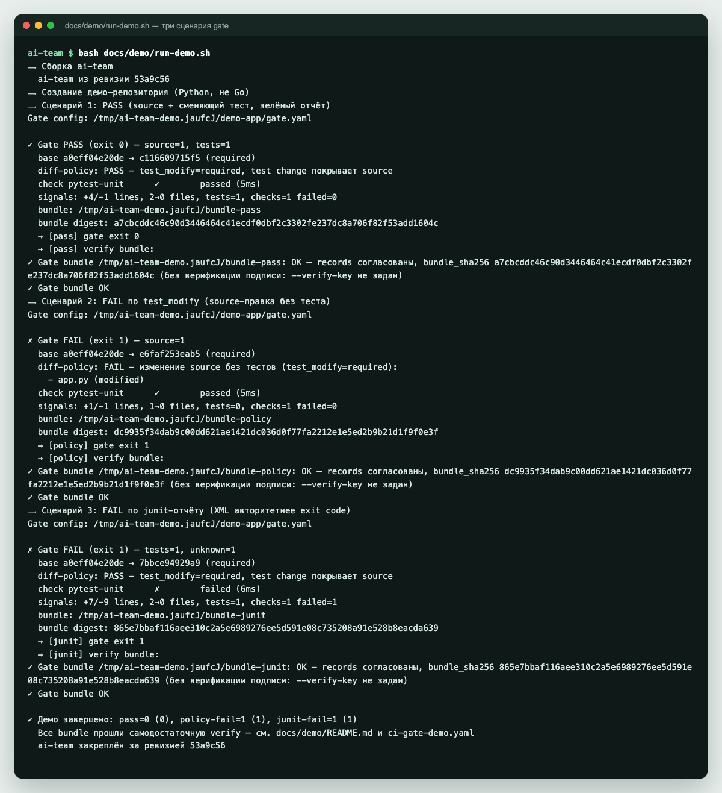

# Проверки в CI без модели

Команда `ai-team gate` проверяет изменение без языковой модели, API-ключей и
агентов. Она сравнивает две ревизии, применяет правило «код меняется вместе с
тестами» и запускает [проверки](../start/concepts.md#проверки) (checks) проекта. Сначала вы прогоните её
локально на готовом демо, затем подключите к pull request в GitHub Actions.

> [!LEARN]
> - как за пять минут увидеть gate в деле на демо-репозитории;
> - чем PASS, FAIL и BLOCKED отличаются и что означает каждый код выхода;
> - как подключить gate к GitHub Actions и что в файле нужно поменять;
> - почему без branch protection gate ничего не блокирует.

## Что понадобится

- Git и Bash.
- Go версии 1.26.5 или новее (минимальная версия записана в `go.mod`).
- Клон репозитория ai-team.

Модель, OpenCode, Codex, Claude Code и авторизация GitHub для этого маршрута не
нужны. Gate — детерминированный слой: при одинаковом входе он даёт одинаковый
вердикт.

## 1. Запустить демо локально

Из корня клона ai-team выполните:

```bash
git rev-parse --short HEAD
bash docs/demo/run-demo.sh
```

Скрипт собирает `ai-team` из текущей ревизии и создаёт во временном каталоге
маленький Python-репозиторий `demo-app`. В нём лежит
[`gate.yaml`](../demo/gate.yaml) с двумя правилами: изменение кода требует
изменения тестов, а JUnit-отчёт тестов должен быть зелёным. Затем скрипт
прогоняет три сценария от одного базового коммита.

В конце вы увидите:

```text
✓ Демо завершено: pass=0 (0), policy-fail=1 (1), junit-fail=1 (1)
  Все bundle прошли самодостаточную verify — см. docs/demo/README.md и ci-gate-demo.yaml
  ai-team закреплён за ревизией 53a9c56
```

В скобках указан ожидаемый код, перед скобками — фактический. Если они
расходятся, скрипт завершается с кодом 1 и сообщением `✗ Демо НЕ прошло
assertion`.



> [!NOTE]
> Демо не запускает pytest. Команда проверки в демо-`gate.yaml` копирует
> заранее подготовленный отчёт ([`pytest-pass.xml`](../demo/pytest-pass.xml)
> или [`pytest-fail.xml`](../demo/pytest-fail.xml)) в `report.xml`. Так
> результат не зависит от окружения. В своём проекте замените эту команду на
> настоящий запуск тестов — см. [Настроить проверки проекта](project-checks.md).

## 2. Разобрать три сценария

| Сценарий | Что изменилось | Код | Почему такой вердикт |
|---|---|---|---|
| `pass-fix` | Код `app.py` и тест к нему, отчёт тестов зелёный | `0` | Правило соблюдено, проверка прошла |
| `policy-fail` | Только `app.py`, тесты не тронуты | `1` | `test_modify: required`: код поменяли, тесты — нет |
| `junit-fail` | Тест есть, но в отчёте JUnit записан упавший тест | `1` | Gate читает сам отчёт и не верит одному коду выхода команды |

Для каждого сценария gate пишет [пакет доказательств](../start/concepts.md#доказательства) (bundle): вердикт, список
изменённых файлов, результаты проверок и SHA-256 каждого файла. Сразу после
этого скрипт вызывает `ai-team verify <bundle>`. Эта команда проверяет пакет
сама по себе, без исходного репозитория и без каталога `.ai-team`.

Обратите внимание: пакеты обоих FAIL-сценариев тоже проходят `verify`.
`verify` подтверждает, что записи пакета целы и согласованы между собой, а не
то, что изменение хорошее. Провал записан в вердикте внутри пакета.

### Коды выхода gate

| Код | Вердикт | Что это значит |
|---|---|---|
| `0` | PASS | Правило про тесты и все обязательные проверки прошли |
| `1` | FAIL | Нарушено правило про тесты или упала обязательная проверка; пакет записан |
| `2` | BLOCKED | Gate не смог выполниться: ошибка конфигурации, нет локальной ревизии, грязное рабочее дерево |

Полный список причин — в [Статусы и коды выхода](../reference/statuses.md#ai-team-gate).

> [!IMPORTANT]
> PASS означает «прошло то, что настроено». Если в `gate.yaml` нет проверок,
> PASS говорит только о том, что рядом с кодом изменились тесты, а не о том,
> что они запускались. В выводе это видно по строке `checks: не заданы`.

> [!TIP]
> Временный каталог демо удаляется при выходе. Чтобы потрогать пакет руками,
> запустите gate в своём репозитории с `--out` (шаг 3) и попробуйте изменить
> любой файл пакета: `ai-team verify` ответит `не совпадает со своим sha256
> (evidence подменён)` и завершится с кодом 1. Файлы пакета создаются только
> для чтения, поэтому для такого эксперимента сначала скопируйте пакет и
> выполните `chmod -R u+w` на копии.

## 3. Проверить свой репозиторий локально

Положите в корень своего проекта `gate.yaml`. Gate ищет его в корне цели, затем
в `.ai-team/gate.yaml`; путь можно задать флагом `--config`. Минимальный
вариант:

```yaml
schema_version: 1
diff_policy:
  test_modify: required   # required | warning | off
checks: []
```

Без файла gate работает с настройками по умолчанию: `test_modify: required`,
проверок нет. Как добавить настоящие тесты в `checks`, описано в
[Настроить проверки проекта](project-checks.md).

Проверить незакоммиченную работу относительно последнего коммита:

```bash
ai-team gate --out /tmp/my-gate-bundle
```

По умолчанию `--base HEAD`, а `--candidate WORKTREE` — текущее рабочее дерево.
Проверить готовую ветку относительно `main`:

```bash
ai-team gate --base main --candidate HEAD --out /tmp/my-gate-bundle
ai-team verify /tmp/my-gate-bundle
```

> [!PITFALL]
> При `--candidate HEAD` (или другой ревизии) gate требует чистое рабочее
> дерево. Любой неотслеживаемый файл, например отчёт `report.xml` от
> предыдущего прогона или каталог пакета внутри репозитория, даёт BLOCKED с
> кодом 2: `Git working tree содержит untracked-файлы вне .gitignore …`.
> Добавьте файлы отчётов в `.gitignore` и пишите пакет за пределы репозитория.

> [!PITFALL]
> В режиме `WORKTREE` gate видит изменения отслеживаемых файлов. Новый файл,
> который вы ещё не добавили через `git add`, в сравнение не попадает: новый
> тест не засчитается, и правило `test_modify` сработает так, будто тестов нет.
> Перед локальной проверкой выполните `git add` для новых файлов.

## 4. Подключить gate в GitHub Actions

Скопируйте [`ci-gate-demo.yaml`](../demo/ci-gate-demo.yaml) в свой репозиторий
как `.github/workflows/gate.yaml`, а рядом с корнем проекта положите свой
`gate.yaml`. Workflow срабатывает на каждый pull request и делает следующее:

1. Забирает историю целиком (`fetch-depth: 0`) и находит общего предка
   PR-ветки и целевой ветки (`git merge-base`).
2. Собирает `ai-team` из зафиксированной ревизии `AI_TEAM_SHA`.
3. Запускает `ai-team gate --target . --base <merge-base> --candidate HEAD --out bundle`.
4. Всегда, даже после FAIL, выполняет `ai-team verify bundle` и загружает
   пакет артефактом `ai-team-gate-bundle`.

Код 1 или 2 от gate роняет job. Пакет при этом уже загружен, и его можно
скачать со страницы запуска.

### Что поменять в файле

| Что | Где | Как |
|---|---|---|
| Версия ai-team | `env.AI_TEAM_SHA` | Полный SHA коммита ai-team. В файле стоит заглушка из нулей — с ней сборка упадёт. Не используйте `latest` и имена веток |
| Версия Go | `go-version` в шаге `actions/setup-go` | Версия, с которой собирается выбранная ревизия ai-team (не ниже `go` из её `go.mod`) |
| Правила проекта | `gate.yaml` в корне | Ваши `diff_policy` и `checks` |
| Пины actions | `uses: …@<sha>` | Обновляйте SHA вместе с комментарием версии, когда обновляете actions |

Вместо сборки из SHA можно скачивать подписанный релизный бинарник
конкретной версии `vX.Y.Z` и проверять его подпись, как в учебнике
[Установка](../tutorial/install.md#вариант-а-готовый-бинарник).

> [!NOTE]
> Если ваши проверки запускают Python, Node или другие инструменты, добавьте
> в workflow шаги их установки до шага `Gate`. Gate запускает команды из
> `checks` как есть и не готовит окружение.

## 5. Сделать проверку обязательной для merge

> [!IMPORTANT]
> Сам по себе workflow ничего не блокирует. Красный job — только отметка на
> pull request. Merge запрещается, лишь когда job `gate` объявлен
> обязательной проверкой (required status check) в правилах защиты ветки.

В GitHub откройте **Settings → Branches** (или **Rules → Rulesets**), создайте
правило для целевой ветки и включите **Require status checks to pass before
merging**. В списке проверок выберите `gate` — имя job из workflow. Проверка
появится в списке после первого запуска workflow на любом pull request.

## Gate и полный прогон

Gate — лёгкий слой: только правило про тесты и проверки. Полный прогон
(`ai-team run`) добавляет агентов, подтверждение плана поставки и поставку
через commit, push и PR. Оба используют одни и те же типизированные проверки,
поэтому `checks` из `gate.yaml` можно перенести в `.ai-team/config.yaml`.

## Что дальше

- [Настроить проверки проекта](project-checks.md) — подключить настоящие тесты
  вместо фикстуры.
- [Проверить и передать результат](evidence.md) — `verify`, подпись пакета и
  передача доказательств.
- [Команды CLI](../reference/cli.md) — все флаги `gate` и `verify`.
- [Статусы и коды выхода](../reference/statuses.md) — сводная таблица кодов.
