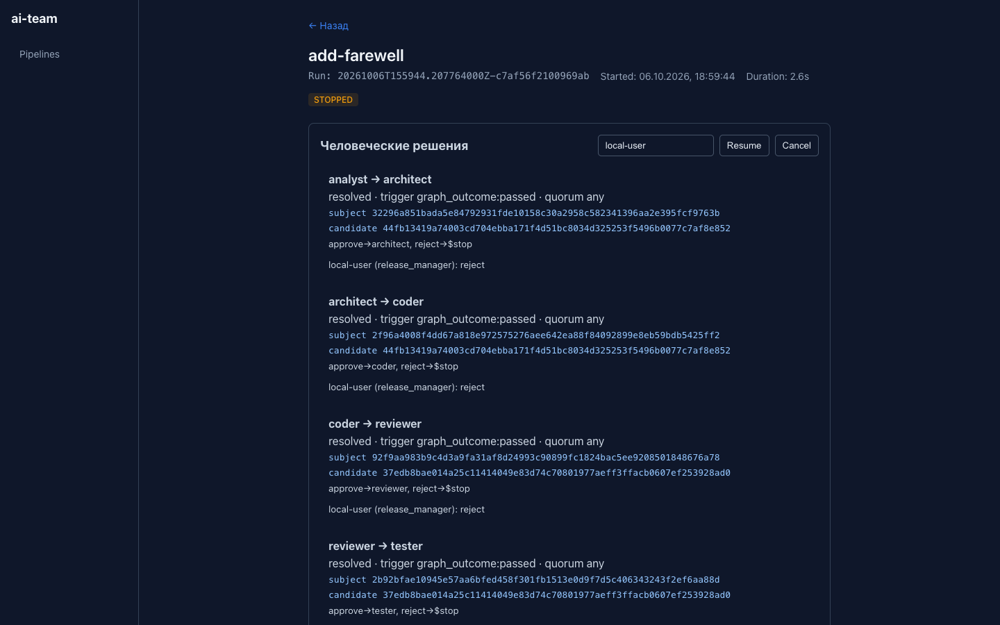
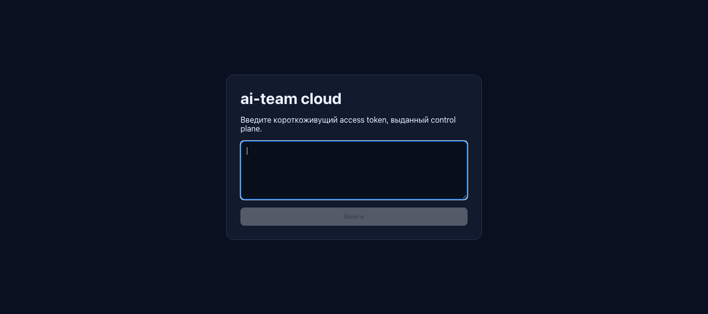

# Веб-дашборд

Дашборд показывает прогоны проекта в браузере: этапы, артефакты агентов,
подтверждения и итог. Из него же можно запустить прогон, принять решение и
продолжить остановленный прогон. Дашборд встроен в CLI и запускается одной
командой.

> [!LEARN]
> - как открыть дашборд для своего проекта;
> - что показывает каждый экран;
> - как подтвердить план поставки и продолжить прогон кнопками;
> - как включить вход по токену, если дашборд нужен не только вам.

## Что понадобится

- Собранный `ai-team` и проект после `ai-team init`.
- Браузер на той же машине.
- Для запуска прогонов из дашборда — то же, что для `ai-team run`: runtime в
  `PATH`, разрешённые ключи, `remote origin` и авторизованный `gh`.

## 1. Запустить дашборд

Из корня проекта выполните:

```bash
ai-team web
```

```text
Web UI available at http://127.0.0.1:8080
```

Откройте адрес в браузере. Порт меняется флагом `--port`, проект — флагом
`--target`. Остановить сервер — `Ctrl+C`.

Дашборд хранит свою базу в `.ai-team/web.db`. Туда же пишет и `ai-team run`
из терминала, поэтому в дашборде видны все прогоны проекта, где бы их ни
запустили.

> [!WARNING]
> Без входа по токену дашборд не проверяет, кто к нему обращается. Любой, кто
> достучится до порта, может запустить прогон и подтвердить поставку. Поэтому
> без токена сервер слушает только `127.0.0.1`: попытка указать другой адрес
> завершится ошибкой `web UI не имеет authentication и может bind только
> loopback host`. Не обходите это ограничение через проброс портов или прокси.

## 2. Посмотреть список прогонов


На главном экране:

- **Фильтры по статусу** — `running`, `waiting_for_approval`, `completed`,
  `failed`, `blocked`, `stopped` и другие. Значения статусов описаны в
  [Статусы и коды выхода](../reference/statuses.md).
- **Форма нового прогона** — имя фичи (`feature-name`), описание задачи и
  кнопка **Новый run**. Это то же, что `ai-team run --feature … --task …`.
- **Готовность окружения** — тот же отчёт, что печатает CLI перед прогоном:
  runtime, модель, ключи, Git, remote, `gh`.
- **Карточки прогонов** — имя фичи, время старта, длительность и статус.

> [!NOTE]
> Дашборд строже терминала. CLI запускает прогон, даже если не настроены
> remote или `gh`, а дашборд отказывает, пока не пройдены все пункты с
> пометкой `required`. Прогон из дашборда выполняется внутри процесса
> `ai-team web`, поэтому `PATH` и `AI_TEAM_HARNESS_ENV_ALLOW` должны быть
> заданы в окружении этого процесса.

## 3. Подтвердить план и продолжить прогон

Прогон, которому нужно решение человека, получает статус
`WAITING_FOR_APPROVAL`. Откройте его карточку.


В блоке **Человеческие решения** перечислены переходы между этапами. У
каждого видно:

- состояние (`pending` — ждёт, `resolved` — решено) и причину запроса
  (`trigger`);
- `subject` — SHA-256 того, что подтверждается, и `candidate` — SHA-256
  состояния кандидата;
- куда ведёт каждое действие: `approve→coder, reject→$stop`;
- кнопки действий с ролью, от имени которой принимается решение.

Чтобы подтвердить поставку:

1. Разверните **Payload (canonical JSON)** у перехода `deployer → deployer`
   с `trigger delivery_plan` и прочитайте [план поставки](../start/concepts.md#план-поставки):
   файлы, ветку, сообщение коммита и текст PR.
2. Впишите своё имя в поле рядом с кнопкой **Resume** (по умолчанию
   `local-user`) — оно попадёт в доказательства как автор решения.
3. Нажмите **approve · release_manager** у этого перехода.
4. Нажмите **Resume**. Прогон продолжится и выполнит поставку.

Решение само по себе прогон не продолжает: без **Resume** он так и останется
в ожидании. Кнопка **Cancel** отменяет прогон (статус `canceled`).

> [!PITFALL]
> В профилях `standard` и `fast` подтверждения переходов между этапами
> отложены и закрываются одним решением о поставке. Дашборд показывает у них
> кнопки, но нажатие вернёт ошибку `deferred approval разрешается consolidated
> delivery-решением`. Принимайте решение у перехода с `trigger delivery_plan`:
> после **Resume** отложенные переходы закроются вместе с ним. В профиле
> `regulated` каждый переход подтверждается отдельно.

Отказ (`reject`) у плана поставки останавливает прогон со статусом
`STOPPED`, и поставки не будет.



## 4. Разобрать завершённый прогон


Под решениями на странице прогона два блока:

- **Маршрут workflow** — граф этапов из конфигурации: точка входа, лимиты
  повторов (`coder · max 3`) и переходы для каждого исхода, включая возврат к
  `coder` после отказа ревьюера или тестов.
- **Этапы** — каждая попытка с исходом (`PASSED`, `SKIPPED`), вердиктом агента
  (`APPROVED`, `PASS`) и длительностью. Под этапом выводится причина
  остановки, если она была.

Щёлкните по этапу, чтобы раскрыть подробности попытки:

- **Проверки** — каждая проверка с классом, командой, статусом, кодом выхода
  и причиной провала;
- **Мутации** — какие файлы изменил этап;
- **Delivery** — шаги поставки и ссылка на PR, если этап доставлял;
- **Лог attempt** — последние 64 KiB лога runtime;
- ссылки на артефакты этапа.


Артефакт показывается как Markdown; кнопка **Raw** открывает исходный текст.
Путь вверху указывает, к какой попытке он относится. Это копия из
доказательств прогона (`.ai-team/runs/<run_id>/attempts/…`), а не текущий
файл в рабочем каталоге.

## 5. Включить вход по токену

Если дашбордом пользуются несколько человек или он работает на сервере,
включите вход по токену. Тогда сервер можно открыть и на другом адресе, а
каждое решение записывается от имени конкретного человека с проверенной
ролью.

1. Сгенерируйте общий секрет не короче 32 байт и задайте его в окружении
   сервера:

   ```bash
   export AI_TEAM_AUTH_SECRET="$(openssl rand -hex 32)"
   ai-team web --host 0.0.0.0 --port 8080
   ```

   Имя переменной меняется флагом `--auth-secret-env`. Если переменная пуста,
   вход выключен.

2. С тем же секретом в окружении выпустите токен для человека:

   ```bash
   ai-team auth-token --actor alice --roles release_manager,qa --ttl 8h
   ```

   Команда печатает токен вида `v1.eyJ…`. Роли: `product_owner`, `architect`,
   `developer`, `reviewer`, `qa`, `release_manager`. Срок жизни — не больше
   `24h`, по умолчанию `1h`.

3. Передайте токен человеку безопасным каналом. Он вставляет его на экране
   входа и нажимает **Войти**.



После входа браузер получает сессию на 8 часов. Решения записываются от
имени `--actor` из токена, а кнопки работают только для ролей из `--roles`.
Сессии хранятся в памяти сервера: после перезапуска `ai-team web` нужно
войти заново.

| Ошибка | Причина |
|---|---|
| `cloud identity: signing secret должен содержать минимум 32 байта` | Переменная с секретом не задана или секрет короче 32 байт |
| `cloud identity: token TTL должен быть в диапазоне (0, 24h0m0s]` | `--ttl` больше суток |
| `cloud identity: неизвестная роль "admin"` | Роль не из списка выше |

> [!WARNING]
> Сервер дашборда отдаёт обычный HTTP без TLS. Открывая его в сеть, ставьте
> перед ним прокси с HTTPS, иначе токен и cookie сессии пойдут открытым
> текстом. Секрет `AI_TEAM_AUTH_SECRET` даёт право выпускать токены с любыми
> ролями: храните его как пароль администратора. И помните, что агенты
> выполняются с правами процесса `ai-team web` — это не песочница, см.
> [Граница безопасности](../reference/security.md).

## Что дальше

- [Остановки и BLOCKED](troubleshooting.md) — что делать, если прогон
  остановился.
- [Проверить и передать результат](evidence.md) — проверить доказательства и
  собрать пакет.
- [Команды CLI](../reference/cli.md) — все флаги `web` и `auth-token`.
