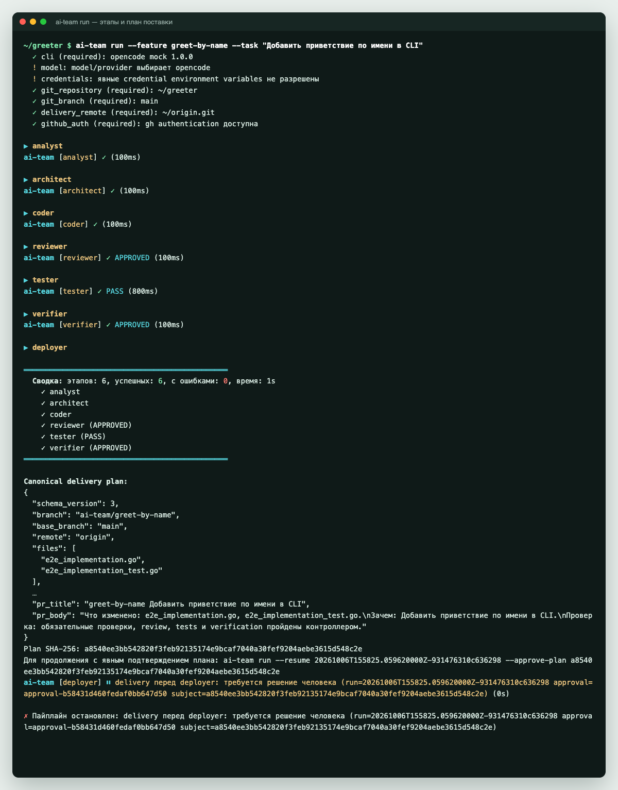
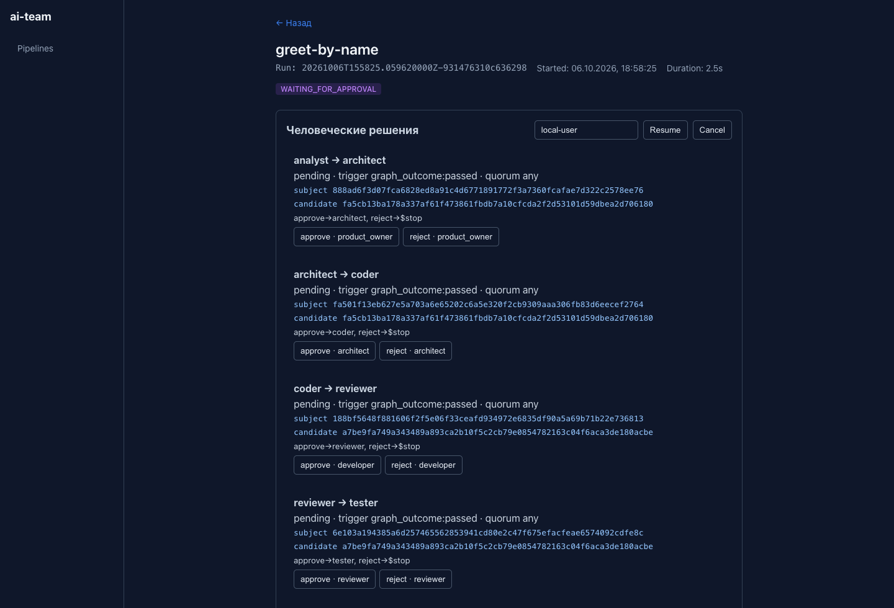

## Чем ai-team отличается

**Правила выполняет программа, а не модель.** Агенты пишут план, код, тесты и ревью. Переходы между этапами, разрешённые пути, запуск тестов и запись доказательств выполняет Go-контроллер. Если модель «решила», что всё готово, а тесты не прошли, дальше задача не пойдёт.

**Вы подтверждаете точный план, а не «в целом да».** Перед коммитом контроллер собирает delivery-план: ветку, файлы, их хеши, сообщение коммита и описание PR. Вы подтверждаете SHA-256 именно этого плана. Если после подтверждения что-то изменится, план придётся подтвердить заново.

**Каждый прогон можно проверить потом.** Что делал каждый агент, какие проверки прошли и кто что решил, лежит в `.ai-team/runs/`. Команда `ai-team verify` проверяет, что записи никто не подменил.

**Модель выбираете вы.** Агенты работают через OpenCode, Codex или Claude Code. Правила процесса от этого не меняются.



## Попробовать за пять минут

Детерминированные проверки работают без модели и ключей. Скрипт собирает ai-team и прогоняет три сценария на учебном Python-репозитории:

```bash
git clone https://github.com/arturpanteleev/ai-team.git
cd ai-team
bash docs/demo/run-demo.sh
```

Дальше откройте [учебник](tutorial/install.md): за четыре шага вы проведёте задачу от описания до pull request, сначала с агентами-заглушками, потом с настоящей моделью.

## Для команды, в облаке

ai-team разворачивается на сервере или в облаке, и вся команда работает в одном дашборде: запускает прогоны, видит, что ждёт решения, подтверждает переходы по своим ролям и открывает артефакты агентов.



Уже сейчас есть всё для одной команды: вход по подписанному токену, роли в подтверждениях, очередь заданий с несколькими исполнителями и архив доказательств. Enterprise-возможности — разделение ответственности между командами и зонами, управление пользователями, корпоративный SSO — следующий этап. Подробнее — в [Подходит ли вам](start/fit.md).

> [!NOTE]
> ai-team не изолирует агентов сам. В облаке запускайте исполнителей в одноразовых контейнерах с доступом только к нужному репозиторию. Подробнее — в [Границе безопасности](reference/security.md).

Требования к общему persistent workspace и восстановлению заданий после потери worker описаны в [руководстве по восстановлению](guides/worker-recovery.md).

## Чего ai-team не делает

ai-team не заменяет AI-инженера вроде Devin или Copilot и не обещает, что код станет лучше. Он отвечает за то, чтобы в репозиторий попадало только проверенное и подтверждённое вами. Как он сочетается с другими инструментами, разобрано в [сравнении](start/compare.md).
