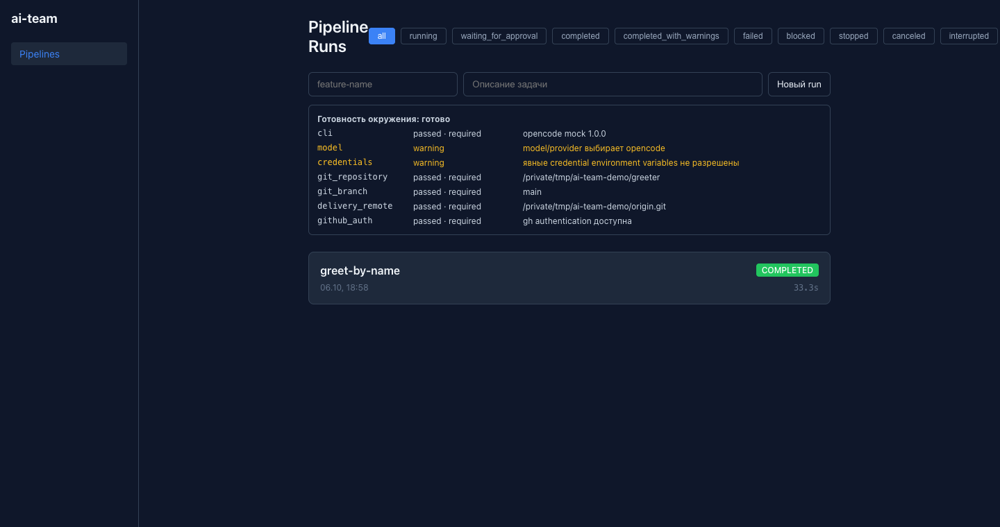

# Подходит ли вам

ai-team не пишет код лучше других агентов. Он задаёт команде правила, по которым код от агентов попадает в репозиторий: с проверками, ревью и подтверждением человека. Найдите свою ситуацию ниже — и сразу увидите, с чего начать.

## Команда разработки: общий процесс для AI-кода

**Ситуация.** В команде несколько человек, и агентами пользуются все по-разному. Кто-то проверяет код агента, кто-то нет. Хочется одного процесса: что агенту можно менять, какие проверки обязательны, кто подтверждает delivery и где потом посмотреть, как всё было.

**Что даст ai-team.** Конвейер и правила лежат в конфигурации проекта, в репозитории, рядом с кодом. ai-team разворачивается на сервере или в облаке, и команда работает через веб-дашборд:

- владелец продукта или архитектор запускает прогон из браузера;
- каждый видит, какие прогоны идут и какие ждут решения;
- подтверждать переходы могут только люди с нужной ролью: `product_owner`, `architect`, `developer`, `reviewer`, `qa`, `release_manager`;
- прогоны исполняют отдельные исполнители из общей очереди, а доказательства каждого прогона архивируются.

**С чего начать.** Пройдите [учебник](../tutorial/install.md) на одном репозитории, затем разверните [дашборд для команды](../guides/dashboard.md) и [настройте проверки проекта](../guides/project-checks.md).

> [!IMPORTANT]
> ai-team не изолирует агентов сам: агент работает с правами процесса, который его запустил. В облаке запускайте исполнителей (`ai-team worker`) в одноразовых контейнерах с доступом только к нужному репозиторию. Подробнее — в [Границе безопасности](../reference/security.md).

## Разработчик: попробовать на своём проекте

**Ситуация.** Вы уже даёте задачи coding-агенту, и он коммитит сам. Хочется понять, что изменится, если между «агент написал» и «попало в main» встанут обязательные тесты, ревью и ваше подтверждение.

**Что даст ai-team.** Каждая задача проходит один путь: анализ, архитектура, код, ревью, тесты, верификация. Обязательные проверки проекта сильнее мнения модели. Коммит, push и PR делает контроллер и только после того, как вы подтвердили точный хеш delivery-плана.

**С чего начать.** [Установка](../tutorial/install.md), затем [Первая задача без модели](../tutorial/first-run.md). Весь путь можно пройти без ключей и настоящей модели, а потом перенести на сервер команды без изменений в конфигурации.

## Уже есть Copilot или Devin: нужен контроль в CI

**Ситуация.** Код пишет готовый агент, и менять его вы не собираетесь. Но в CI нужна независимая проверка без модели: изменили исходники — должны измениться и тесты, обязательные проверки прошли, результат можно проверить потом.

**Что даст ai-team.** Команда `ai-team gate` работает без модели. Она сравнивает базу и кандидата, применяет правила к изменениям, запускает проверки и пишет пакет доказательств, который проверяется отдельно командой `ai-team verify`. Агент остаётся прежним, ai-team становится ещё одной проверкой в CI.

**С чего начать.** [Проверки в CI без модели](../guides/ci-gate.md).

> [!TIP]
> Чтобы gate блокировал merge, сделайте его обязательной проверкой (required check) в настройках защиты ветки.

## Компания: несколько команд и зоны ответственности

**Ситуация.** ai-team нужен не одной команде, а подразделению или всей компании: много команд и репозиториев, у каждой свои зоны ответственности, пользователи приходят из корпоративного каталога.

**Что есть сейчас.** Всё, что нужно одной команде: сервер с дашбордом, вход по подписанному токену, роли в подтверждениях, очередь заданий с несколькими исполнителями, архив доказательств. Пилот в одной команде можно начинать уже сегодня.

**Что будет дальше.** Enterprise-уровень — следующий этап развития:

- разделение ответственности между командами и зонами (кто какие репозитории и этапы ведёт);
- управление пользователями и вход через корпоративный SSO;
- изоляция исполнителей и секретов между командами.

**С чего начать.** Пилот в одной команде на одном репозитории. Как сравнить ai-team с другими вариантами на своей задаче, разобрано в [Сравнении](compare.md#как-проверить-выбор-на-своём-проекте).

## Что дальше

- [Как это выглядит](tour.md) — экраны терминала и дашборда до установки.
- [Сравнение](compare.md) — ai-team рядом с другими системами процесса разработки и runtime-фреймворками.
- [Установка](../tutorial/install.md) — попробовать на своём проекте.
