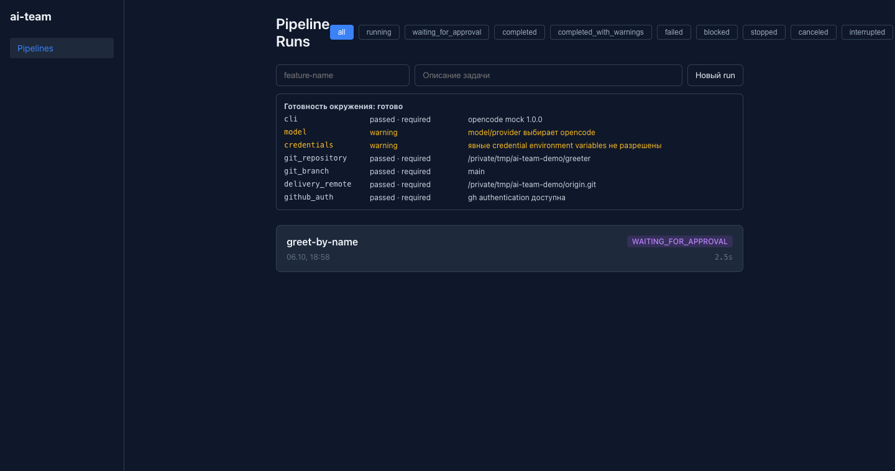

# Как это выглядит

Один прогон ai-team от задачи до pull request, кадр за кадром. Все скриншоты сняты на настоящем `ai-team` в учебном режиме: вместо модели работают агенты-заглушки, вместо GitHub — заглушка `gh`. Контроллер, проверки, план поставки и дашборд при этом настоящие.

> [!LEARN]
> - что делают агенты и что проверяет контроллер;
> - где прогон останавливается и ждёт вас;
> - что вы подтверждаете и что происходит после;
> - что будет, если сказать «нет».

## Вы ставите задачу

Прогон начинается с одной команды в вашем репозитории. Задача — обычный текст, имя фичи станет именем ветки.

```bash
ai-team run --feature greet-by-name --task "Добавить приветствие по имени в CLI"
```

Сначала контроллер проверяет окружение: найден ли CLI агента, есть ли Git-репозиторий и ветка, есть ли куда пушить и авторизован ли `gh`. Жёлтые строки — предупреждения, зелёные — пройденные проверки.

## Агенты работают по очереди

Дальше задача идёт по цепочке агентов. У каждого своя роль и свой набор файлов, которые ему разрешено менять.

| Агент | Что делает |
|---|---|
| analyst | Превращает задачу в требования и критерии приёмки |
| architect | Пишет технический дизайн и список задач |
| coder | Меняет код в отдельной копии репозитория — кандидате |
| reviewer | Читает изменения и выносит вердикт: `APPROVED` или вернуть на доработку |
| tester | Пишет тесты, а контроллер сам запускает проверки проекта (`go test`, `go vet`) |
| verifier | Сверяет результат с критериями приёмки |
| deployer | Готовит план поставки, но сам ничего не коммитит |


Вердикт агента — только заявка. Контроллер сам проверяет, что агент менял только разрешённые файлы, что проверки действительно прошли и что все нужные артефакты на месте. Если ревьюер вернул код на доработку, задача уходит обратно к coder, но не больше заданного числа раз.

## Контроллер останавливается и ждёт вас

Когда все этапы пройдены, контроллер собирает **план поставки**: ветку, список файлов с хешами, сообщение коммита, заголовок и описание PR. Он печатает план и его SHA-256 и останавливается с кодом 3. Без вашего решения коммита не будет.

Тот же прогон виден в веб-дашборде (`ai-team web`). Прогон в статусе `WAITING_FOR_APPROVAL`:



На странице прогона видно, какие решения ещё не приняты. У каждого перехода есть отпечатки предмета решения (`subject`) и кандидата (`candidate`). Решение относится ровно к этому состоянию кода.


## Вы подтверждаете план

Прочитайте план. Если он вас устраивает, продолжите прогон с хешем этого плана:

```bash
ai-team run --resume <run_id> --approve-plan <sha256-плана>
```

Контроллер сверяет хеш с планом, который он сам построил. Другой хеш не подойдёт. Если с момента печати плана что-то изменилось, подтверждение тоже не подойдёт. Только после этого контроллер делает commit, push и открывает PR.


> [!NOTE]
> В итоговой сводке после продолжения deployer дважды: первая строка — остановка в контрольной точке, вторая — сама поставка. Строка «с ошибками: 1» относится к этой остановке, поставка прошла успешно.

> [!DEEPDIVE] Почему хеш, а не просто «да»
> Ответ «да» не говорит, на что именно вы согласились: между вашим «да» и коммитом план мог измениться. Хеш связывает решение с конкретным содержимым, и контроллер выполнит ровно этот план или не выполнит ничего. В интерактивном терминале ai-team показывает тот же план и спрашивает `[y/N]`, а без терминала требует хеш явно. Что именно входит в хеш и как контроллер его сверяет — в учебнике [Подтвердить план и получить PR](../tutorial/approve.md#если-sha-256-не-совпал).

## Итог прогона

После поставки прогон в дашборде получает статус `COMPLETED`. На его странице видно, кто и что решил, по какому маршруту шла задача и чем закончился каждый этап.

, внизу — этапы с вердиктами.")

Любой артефакт агента можно открыть прямо в браузере: требования, дизайн, отчёт о тестах, ревью.


Всё это хранится локально, в `.ai-team/runs/<run_id>/`. Команда `ai-team verify <run_id>` проверяет, что записи прогона целы. Подробнее — в руководстве [Проверить и передать результат](../guides/evidence.md).

## Если сказать «нет»

Вы можете отказаться от поставки: ответить `n` на вопрос в терминале, отклонить решение командой `ai-team decision` или в дашборде. Прогон остановится, коммита не будет, а отказ запишется в историю прогона вместе с остальными решениями.


## Проверки без модели

Детерминированную часть ai-team можно запускать отдельно, например в CI для PR, которые написал кто угодно: человек, Copilot или Devin. Команда `ai-team gate` сравнивает изменения с базовой веткой, запускает проверки проекта и выносит вердикт без LLM.


Как подключить это в GitHub Actions, разобрано в руководстве [Проверки в CI без модели](../guides/ci-gate.md).

> [!TIP]
> Все скриншоты на этой странице снимает скрипт `bash docs/demo/screenshots.sh`. Ему нужны Go, Git, Python 3 и Chrome; модель и сеть не нужны. Если интерфейс изменился, перезапустите скрипт, и картинки обновятся.

## Что дальше

- [Учебник](../tutorial/install.md) — пройти этот же путь самому, шаг за шагом.
- [Ключевые понятия](concepts.md) — что такое кандидат, план поставки и доказательства прогона.
- [Сравнение](compare.md) — где ai-team полезен рядом с Devin, Copilot и другими.
