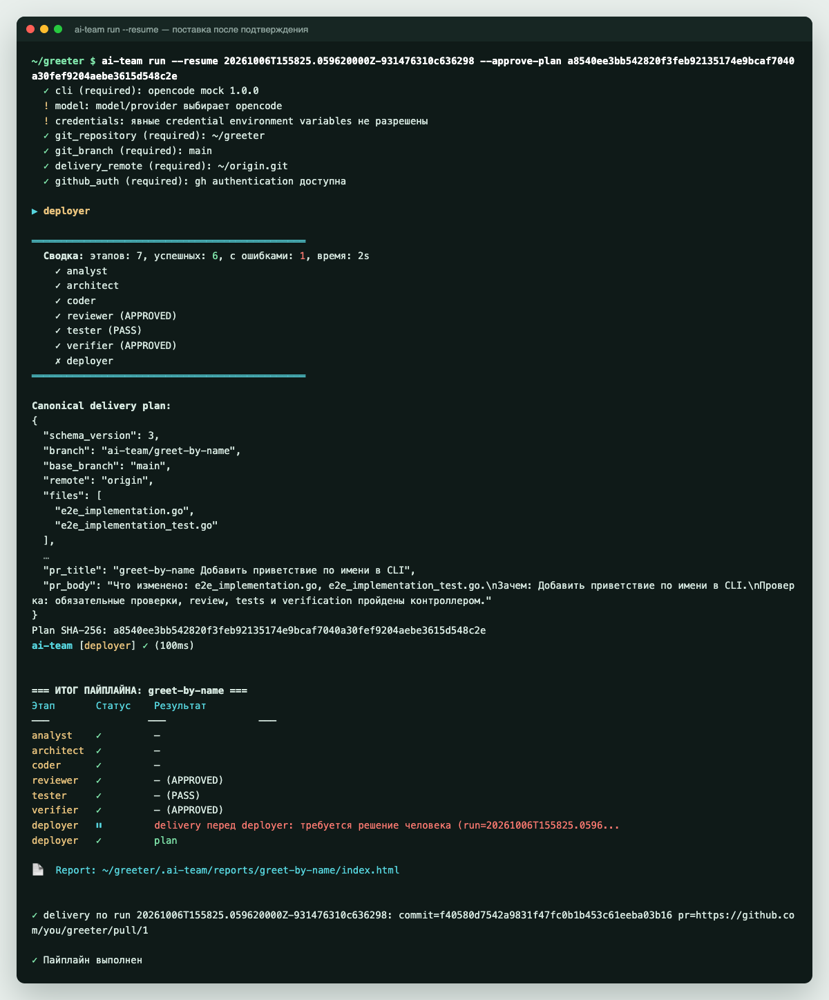
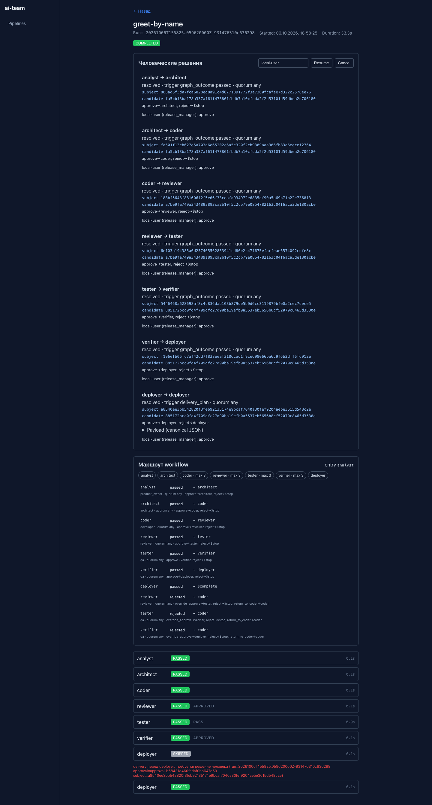
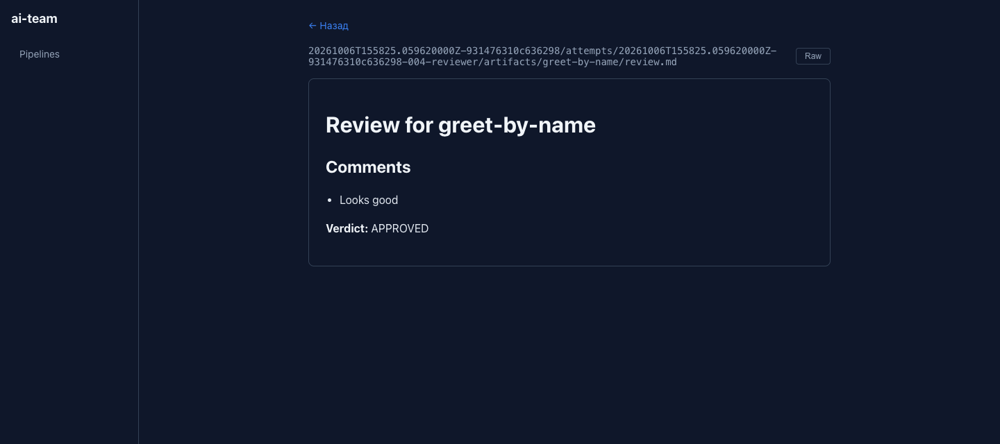

# 3. Подтвердить план и получить PR

Прогон из прошлого шага ждёт вашего решения. Здесь вы прочитаете delivery-план, подтвердите его и получите commit, ветку в `origin` и (заглушечный) pull request. Потом посмотрите, какие доказательства прогона остались и как их проверить.

> [!LEARN]
> - что написано в delivery-плане и что именно вы подтверждаете
> - как продолжить прогон с `--resume` и `--approve-plan`
> - что происходит, если SHA-256 не совпал
> - где лежат доказательства прогона и как их проверить командой `ai-team verify`
> - как посмотреть прогон в дашборде

Продолжаем в том же окне терминала, что и на [шаге 2](first-run.md): в `PATH` стоят заглушки, текущий каталог — `$TUT/greeter`. Если окно закрыли, восстановите окружение:

```bash
export TUT="$HOME/ai-team-tutorial"
export PATH="$TUT/mockbin:$PATH"
cd "$TUT/greeter"
```

## 1. Прочитать delivery-план

Delivery-план (canonical delivery plan, см. [Ключевые понятия](../start/concepts.md#delivery-план)) — это всё, что контроллер сделает после вашего «да». Он напечатан в выводе прогона, а ещё лежит в кандидате (candidate worktree):

```bash
cat .ai-team/worktrees/<run_id>/.ai-team/artifacts/greet-by-name/delivery-plan.json
```

Вместо `<run_id>` подставьте идентификатор из вывода прошлого шага, например `20261006T152959.266311000Z-a661d54efaecd972`.

Что смотреть в плане:

| Поле | Что значит |
|---|---|
| `branch`, `base_branch`, `remote` | в какую ветку, от какой и в какой удалённый репозиторий уйдёт результат |
| `files` | ровно те файлы, что попадут в commit, и никакие другие |
| `file_digests`, `file_modes` | SHA-256 содержимого и права каждого файла — именно эти байты попадут в commit |
| `baseline_head` | коммит, от которого работал прогон |
| `verified_workspace_digest`, `check_evidence_digest` | отпечаток проверенного состояния кандидата и результатов проверок |
| `preconditions` | отчёты ревьюера, тестировщика и верификатора: размер, SHA-256 и вердикт |
| `commit_message`, `pr_title`, `pr_body` | текст коммита и PR |

Сами файлы лежат в кандидате. Загляните в них, прежде чем подтверждать:

```bash
git -C .ai-team/worktrees/<run_id> status --short
cat .ai-team/worktrees/<run_id>/e2e_implementation.go
```

```text
?? e2e_implementation.go
?? e2e_implementation_test.go
package e2eimplementation

const Feature = "greet-by-name"
```

В учебном режиме это заготовка заглушки, а не настоящее приветствие. С настоящей моделью здесь будет её код, и именно сейчас стоит его прочитать. Ваша ветка `main` всё ещё не тронута: `git status --short` в корне проекта пуст.

## 2. Подтвердить план

Подтверждение (approval) — это SHA-256 плана, который вы прочитали. Возьмите `run_id` и `Plan SHA-256` из вывода прошлого шага:

```bash
ai-team run --resume <run_id> --approve-plan <sha256>
```

Ту же команду с уже подставленными значениями `ai-team` напечатал перед остановкой — строка «Для продолжения с явным подтверждением плана».

Контроллер снова проверит окружение, сверит план с сохранённым и выполнит delivery. Конец вывода:

```text
✓ delivery по run 20261006T152959.266311000Z-a661d54efaecd972: commit=0eb26bb7b9f22c1ef42f32d27b031b3e2ce018b5 pr=https://example.test/pr/1

✓ Пайплайн выполнен
```

Код выхода — `0`. Адрес PR выдуман заглушкой `gh`, а commit и push настоящие.



> [!NOTE]
> В сводке продолжения этап `deployer` отмечен `✗`, а в итоговой таблице есть строка `⏸`. Это след первой остановки, а не новая ошибка. Итог прогона — в последних строках: `✓ delivery …` и `✓ Пайплайн выполнен`.

> [!PITFALL]
> Не подставляйте SHA-256 автоматически, например скриптом через `grep` из вывода. Подтверждение имеет смысл, только если вы прочитали план: так вы говорите «да, именно эти файлы, эти байты, эта ветка». Скрипт, который сам берёт хеш и сам его подтверждает, превращает проверку человеком в формальность.

### Если SHA-256 не совпал

Подойдёт только SHA-256 того плана, что показал контроллер. Опечатка или хеш от другого прогона — и delivery не будет:

```text
✗ Пайплайн остановлен: resume run: --approve-plan 0000…0000 не совпадает с subject approval a80328fb…02bf487d3
```

Код выхода `1`, но прогон не испорчен: он по-прежнему ждёт решения, и правильный хеш сработает.

Если изменился сам план — другие файлы, другое содержимое, другой начальный коммит, — старый хеш не подойдёт ни для одного способа подтверждения. Это не сбой: подтверждение одноразовое и привязано к конкретному плану. Нужен новый план и новое решение.

> [!DEEPDIVE] Почему SHA-256, а не просто «да»
> Между моментом, когда вы прочитали план, и моментом delivery может пройти время. За это время в кандидате могли поменяться файлы, а прогон — перезапуститься. Простое «да» подтвердило бы то, что окажется в кандидате на момент delivery, а не то, что вы видели.
>
> SHA-256 считается от канонического JSON плана. В план входят хеши каждого файла, их права, начальный коммит, отпечаток проверенного кандидата и результатов проверок, хеши отчётов ревьюера, тестировщика и верификатора. Изменится хоть один байт — изменится и хеш.
>
> Перед delivery контроллер сверяет ваш хеш с планом, затем проверяет, что файлы в кандидате совпадают с `file_digests`, а родитель нового коммита — с `baseline_head`. После коммита он ещё раз сверяет закоммиченные байты с планом. Если что-то разошлось, delivery останавливается. Так подтверждение относится к конкретному результату, а не к прогону вообще.

> [!TIP]
> Решение можно записать и без `--approve-plan`: командой `ai-team decision`, которую `ai-team` печатает рядом с подсказкой про `--resume`, или в веб-дашборде. После этого достаточно `ai-team run --resume <run_id>`. Подробнее — [ai-team decision](../reference/cli.md#ai-team-decision).

## 3. Посмотреть результат в Git

Контроллер создал ветку `ai-team/greet-by-name` и отправил её в `origin`:

```bash
git log --oneline origin/ai-team/greet-by-name -2
```

```text
0eb26bb greet-by-name Добавить приветствие по имени в CLI
40e2a9d greeter: первая версия
```

```bash
git show --stat origin/ai-team/greet-by-name
```

```text
commit 0eb26bb7b9f22c1ef42f32d27b031b3e2ce018b5
Author: Tutorial <tutorial@example.test>
…
    greet-by-name Добавить приветствие по имени в CLI

    ai-team-run: 20261006T152959.266311000Z-a661d54efaecd972
    ai-team-runtime: 9523aef3…
    ai-team-attestation: 23ef2c88…

 e2e_implementation.go      | 3 +++
 e2e_implementation_test.go | 7 +++++++
 2 files changed, 10 insertions(+)
```

В commit ровно два файла из плана. Строки `ai-team-run` и `ai-team-attestation` в сообщении связывают коммит с доказательствами прогона. Ветка `main` по-прежнему указывает на ваш первый коммит: в неё `ai-team` ничего не пишет, изменения попадают туда только через PR.

## 4. Открыть дашборд

```bash
ai-team web
```

```text
Web UI available at http://127.0.0.1:8080
```

Откройте адрес в браузере. Если порт 8080 занят, укажите другой: `ai-team web --port 8090`. Остановить сервер — `Ctrl+C`.


На странице прогона видны решения человека, маршрут по этапам и результат каждого этапа. Если открыть дашборд до подтверждения, прогон будет в статусе `WAITING_FOR_APPROVAL`, а решения — в состоянии `pending`:


После подтверждения статус — `COMPLETED`, все решения `resolved`:



По этапам можно открыть документы агентов — спецификацию, дизайн, ревью, отчёты:



Подробнее о дашборде — [Веб-дашборд](../guides/dashboard.md).

## 5. Проверить доказательства прогона

Всё, что произошло в прогоне, записано в `.ai-team/runs/<run_id>/` — доказательства прогона (evidence, см. [Ключевые понятия](../start/concepts.md#доказательства)):

```bash
ls .ai-team/runs/<run_id>/
```

| Что | Что внутри |
|---|---|
| `events.jsonl` | журнал событий; каждое событие ссылается на хеш предыдущего, поэтому правку задним числом видно |
| `attempts/` | по каталогу на каждую попытку этапа: входы, выходы, вердикт, результаты проверок с кодом выхода и выводом `go test` |
| `logs/` | логи агентов |
| `delivery.json` | итог delivery: хеш плана, commit, адрес PR |
| `attestation.json`, `anchor.json` | сводный отпечаток прогона (attestation) и якорь журнала; на attestation ссылается коммит |
| `usage.json` | этапы, попытки, время, токены |

Проверьте, что доказательства целы и согласованы:

```bash
ai-team verify <run_id>
```

```text
✓ Run 20261006T152959.266311000Z-a661d54efaecd972: anchor OK — event chain, manifests digest, attempt manifests и attestation v1 согласованы
✓ Run OK
```

`verify` проверяет целостность записи, а не качество кода: успешная проверка значит, что журнал не правили и всё сходится. Сводка по времени и попыткам — `ai-team usage <run_id>`. Как упаковать доказательства и передать их другому человеку — [Проверить и передать результат](../guides/evidence.md).

## Убрать учебный проект

Когда закончите, удалите учебный каталог целиком — проект, `origin.git` и заглушки:

```bash
rm -rf "$HOME/ai-team-tutorial"
```

И откройте новое окно терминала, чтобы в `PATH` не осталось заглушек.

## Что дальше

- [4. Подключить настоящую модель](real-model.md) — убрать заглушки и поручить задачу настоящему агенту.
- [Остановки и BLOCKED](../guides/troubleshooting.md) — что делать, когда прогон остановился не на delivery.
- [Статусы и коды выхода](../reference/statuses.md) — все коды и статусы в одном месте.
